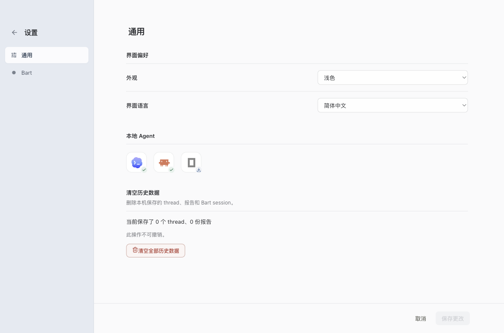
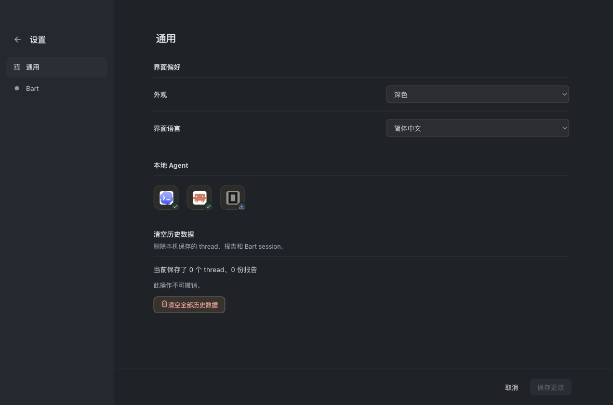
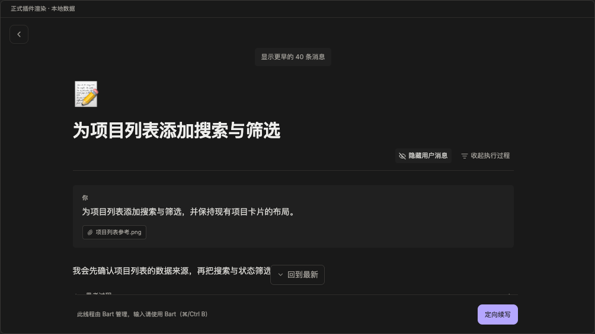
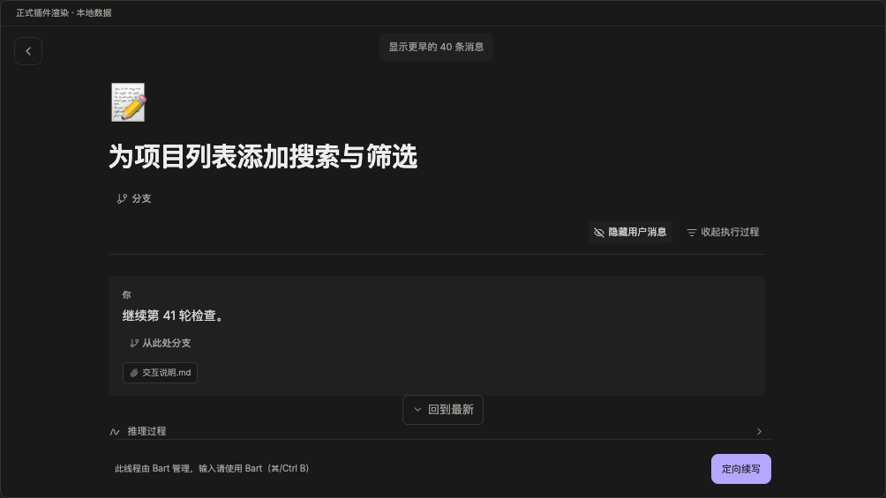

# Appearance visual evidence

Captured on macOS arm64, Electron 43 / Chromium 150, 2026-09-08.
Settings images use the production Electron window and settings save path with
an isolated profile. Harness images use the existing Thread Detail playground's
production Plugin renderers and deterministic history fixtures, with user
messages and execution details expanded. They are visual references, not live
model execution evidence or pixel-perfect golden tests.

| Surface | Light | Dark |
| --- | --- | --- |
| Settings |  |  |
| Codex |  |  |
| Claude |  |  |
| OpenCode |  |  |

Run `pnpm build` followed by `pnpm --dir apps/desktop test:appearance-runtime`
to reproduce native save/cancel, draft/attachment retention, cold starts and
macOS window reopen. The script prints its retained result/screenshot directory.
`application-appearance.test.ts` covers all six preference/system combinations
and dynamic system changes; service regressions cover failed persistence and a
running Execution with unavailable CLI probes. Native evidence uses the actual
system appearance and both manual overrides. Physical OS appearance toggling,
Windows/Linux native chrome, high-contrast modes and other displays were not
tested on this Mac. The window is opaque on every platform, so offscreen page
screenshots are what the compositor shows.

The native regression also samples renderer screenshot alpha in empty Overview
space and final composited animation frames during Bart thread round trips in light/dark
appearance. It checks that Overview and thread backgrounds stay opaque through
handoffs, and direct navigation with reduced motion. These checks detect clear
page wrappers and Canvas contexts.

Report HTML keeps its own colors and isolation. This feature adapts its card
and host controls, and does not promise to recolor report content.
