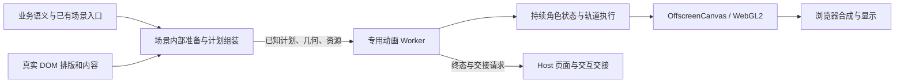

# Bart Motion：执行隔离与内部运行时设计

正式 spec：[GitHub #251](https://github.com/xinyuan0801/OpenAgent/issues/251)，ready-for-agent。

本稿按用户最新优先级重写：当前先完成内部动画执行隔离，暂缓优雅打断，不集中设计通用对外 API。此前已讨论的取消平滑回程保留为后续需求，不作为本阶段验收条件。日期：2026-09-14。

后续进展（2026-09-16）：导航飞行与镜头的连续反向见 [优雅打断实现](bart-graceful-interruption.md)；以下保留最初隔离阶段的范围记录。

## 1. 当前目标

Renderer 主线程暂停执行时，已经启动且资源完整的 Bart 动作链仍能自主推进：角色运动 → 飞行 → 形变 → 真实卡片排字 → 已知卡片接力 → 正常返回/待机 → 等待 Host 交接。

“主线程”指 React/DOM 所在的 Renderer 主线程，不是 Electron Main。目标覆盖下一帧和下一段，不接受只迁移 draw loop、仍在段间等待主线程的实现。

保留角色视觉风格和业务语义，允许微调节奏。系统休眠、GPU 故障和主线程尚未传来的新事实是已有边界。业务立即进入真实状态，视觉可以短暂滞后，但不能控制或回滚业务。

## 2. 本阶段暂缓与必须保留

| 暂缓 | 当前仍然必须完成 |
| --- | --- |
| 所有动画优雅打断、从当前位置平滑回程 | 导航/关闭/目标删除/故障时安全中止，恢复当前应有界面 |
| 速度连续的反向、连续 retarget/replace、可逆退出轨道 | 旧消息不覆盖新场景，焦点、交互锁和资源正确释放 |
| 通用对外 Motion API、计划 DSL、SDK 和固定公开方法 | 场景内部准备完整计划，Worker 不依赖 Host 续播 |
| API 版本、兼容层与通用调试体系 | 必要的内部消息/结果约定和可重复的实际场景测试 |

不要求保留妨碍隔离的逐段 await 实现；允许必要的局部调用适配。也不先要求业务方改为填写眼睛、遮罩和相机轨道。完整内部迁移目标保留，M0 之后仍需逐场景接入生产。

## 3. 执行所有权



- 每窗口一个专用动画 Worker，不与 Markdown 重计算共用。
- Worker 持有角色姿态、速度、时钟、路径、执行状态及 GPU 资源；同一角色跨位置保持身份。
- Host 保留真实业务、DOM、输入、焦点、可访问性与资源准备，不拥有逐帧动画状态。
- 场景内部组装可序列化的完整已知计划，下一帧/下一段不依赖 DOM 测量、React 挂载或 Host Promise continuation。
- Canvas 转移控制权后由 Worker 直接绘制，禁止逐帧把位图送回主线程显示。
- 对 CSS/WAAPI 按真实执行依赖判断，已能独立完成的合成动画可保留；全部迁移场景仍须通过相同隔离验收。

当前必须移除的依赖可从 [生成编排](../src/renderer/src/components/BartThreadGeneration.tsx)、[跨页飞行](../src/renderer/src/components/BartCrossPageFlight.tsx)、[角色](../src/renderer/src/components/BartLogo.tsx)、[页面快照](../src/renderer/src/bart-thread-transition/camera-scene.ts)及[Worker 执行器](../src/renderer/src/bart-motion/motion.worker.ts)追踪。

Harness 继续提交 activity/reply 等语义，语义空间测量回调留在 Host。当前不改变插件职责，也不要求插件或业务调用方编写底层时间线。

## 4. 先验证表面边界

一个 Worker 不等于一个全屏 Canvas 能解决全部位置、滚动、裁剪和层级。

先按共享坐标空间、滚动/相机祖先、裁剪与层叠关系划分承载表面，再选择资源共享方案。普通待机不锁滚动，列表小 Logo 不能靠主线程逐帧纠正位置，也不能为每个实例无界创建 WebGL context。

短演出在受控表面内合成所需角色、卡片和页面资源，播放中不依赖主线程修改层级。相关 Overview 相机或祖先变换必须提前提交或纳入临时固定范围。

M0 同时覆盖 Dock、可滚动列表小 Logo、容器裁剪、设置页遮挡、透明/原生材质与完整短演出。只有全屏角色在 Worker 内运动的 demo 不能通过。M0 输出真实可行的表面/上下文/纹理上限；若组合要求不能满足，先修正承载方案再铺开。

## 5. 准备过程：预热不加锁，临近播放才封口

```text
预热字体 / shader / 静态素材 / 可复用缓存
→ 等待执行资格（不锁界面）
→ 临近播放取得冲突资源与几何依赖锁
→ 校验版本、最终快照、必要上传
→ Worker 自主执行
→ Host 完成有效交接，恢复相关区域
```

预热不持有交互锁，也不占着角色等待其他资源。封口才固定必要的滚动、布局和祖先相机；固定范围由几何依赖决定，不只看最近容器。

最终快照仍可能昂贵，因此封口必须有预算。超预算或版本持续失效时释放锁和资源，恢复真实界面或延后重试，不能锁着界面无限等待字体、Markdown 或布局稳定。

分别测冷/热启动、首次可见反馈、封口、演出和总锁定时长。总锁定包括等待 Host 交接；故意阻塞主线程引起的额外等待单独报告，不能只展示播放帧率。具体预算由 M0 实测后固定。

预热/封口是内部阶段，不增加公共 API 设计任务。

## 6. 真实内容、运行终态与交接

Host 生成真实卡片纹理、字体/换行、行框和显露轨迹，Worker 完成排字及角色绘制。已知卡片可一次准备；未来才到达的内容形成后续演出，不能将未知数据伪装成完整计划。

内部区分三类事实，不固定公开方法名：

1. 已具备自主执行条件并开始运行。
2. Worker 已到达并提交终态；不等于证明终态已显示在物理屏幕。
3. Host 已完成有效交接，该运行不再拥有相关资源和控制权。

主线程迟到时保留最终表面或待机，不超时清空。最新页面可安全显示后尽快结束旧快照覆盖，不为了完成旧表演长期压住真实状态。

交接同时转移画面和交互权：覆盖层展示旧内容时，底下不匹配的新 DOM 不接收该区域指针或键盘输入。目标 DOM 在覆盖下准备，由绑定运行身份、revision 和所有权令牌的有效交接撤下覆盖并恢复命中/焦点。

旧 ready/finish/abort 不能撤掉新覆盖或释放其他运行仍使用的资源。共享纹理按引用释放。DOM ready 和若干次 rAF 不能当作物理呈现确认，透明/阴影/原生材质下的重叠策略要用实际帧验证。

除角色外，相机、遮罩和目标显露也需要明确写入权；两个不同 actor 不能互相覆盖同一个共享相机。实现最小内部冲突规则，不提前建设通用调度框架。

## 7. 基础安全收口与资源

本阶段中止允许安全停止并显示当前真实业务的稳定界面，不要求平滑回程。导航、关闭、目标删除、Worker/context 故障都必须结算结果，释放或正确转交可见性、焦点和区域锁；动画停止不撤销任务、消息或审批结果。

版本化运行、场景和资源，拒绝迟到消息。队列、纹理和上下文有界；稳定时休眠、按需唤醒，隐藏后不持续无意义绘制。避免资源解码/上传给动画 Worker 引入新的无界阻塞。

图形不可用时呈现最终静态界面，不将主线程动画回退称为隔离成功。保留真实表单、键盘、文本选择和屏幕阅读器。

## 8. 里程碑

| 阶段 | 必须交付 |
| --- | --- |
| M0 | 真实生成链在跨段 2/5 秒主线程阻塞下自主推进；联合证明表面/滚动/遮挡、画面与交互交接及冷/热启动/锁定成本 |
| M1 | 从原型沉淀最小内部角色、执行计划、预热/封口、表面及安全生命周期 |
| M2 | 常驻、装饰、回复与反馈、Dock/协调者动作迁移 |
| M3 | 生成/接力、跨页飞行、穿眼镜头及必需页面运动迁移 |
| M4 | Lab/Playground 同步、旧动态实现清理、全场景证据与项目 PR 门禁 |

M0 失败应否决当前承载或交接路径，修正后重测，不直接铺开功能清单。M0 成功仍不等于完整重构完成。优雅打断和对外 API 留到后续独立收敛。

## 9. 验收重点

- 主线程注入真实 2/5 秒同步阻塞，跨过飞行、形变、排字、已知卡片接力、正常返回及交接；异步等待不能代替阻塞。
- 真实可见 Electron 场景 + Worker 执行记录 + Chromium trace + Renderer 外部的内容帧，互相验证。
- 验证 beginFrameSubscription 的捕获能力和扰动；回调到达间隔不直接当显示器帧间隔。合成输出与物理显示分别报告。
- 检查真实角色/文字/页面，加入能检出冻结的负对照。P99 不能替代跨段冻结检测，Worker 自报帧数也不能证明呈现。
- 联合验证 Dock、小 Logo、滚动、裁剪、设置页遮挡、透明材质和输入命中；不以单一全屏 demo 通过。
- 报告首次可见反馈、预热/封口、总锁定、冷/热启动、空闲 CPU/GPU 和纹理/表面数量；正常负载与故意主线程阻塞样本分开。
- 交接阶段注入迟到 Host 和旧版本，验证画面/交互权及资源正确性。基础中止只验安全收口，不验平滑回程或连续替换。
- 生产 loadFile/打包、安全配置、隐藏恢复和长时间资源稳定性纳入验证；新隔离验收接入项目 verification。

正式验收条目以 [#251](https://github.com/xinyuan0801/OpenAgent/issues/251) 为准。
